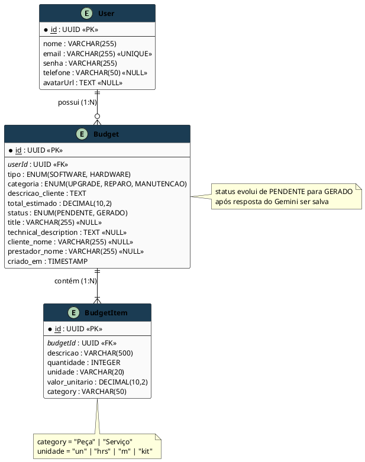
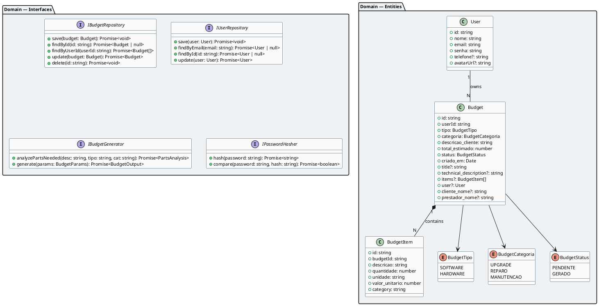
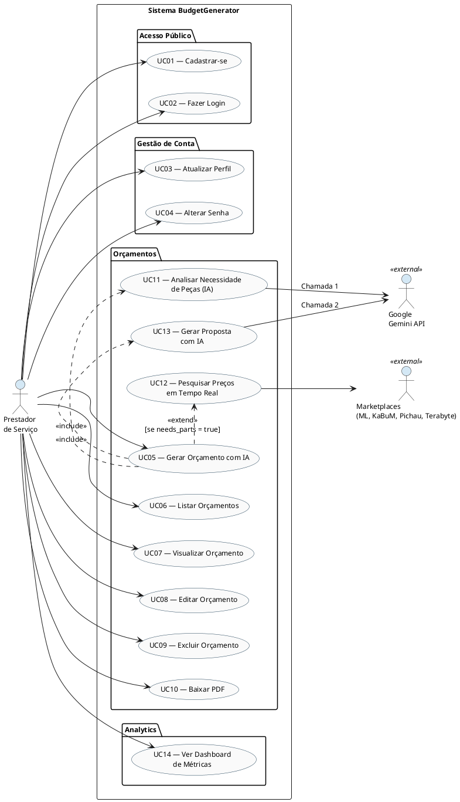
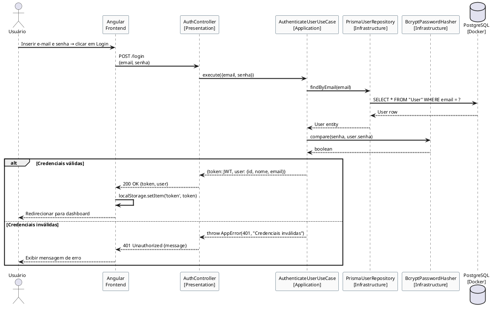
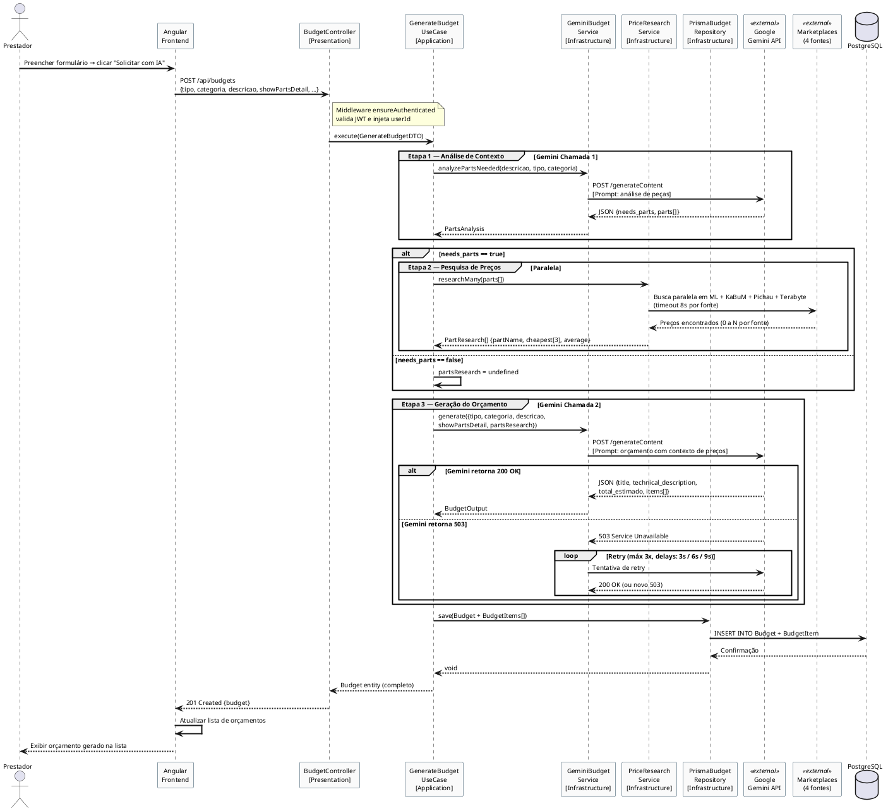
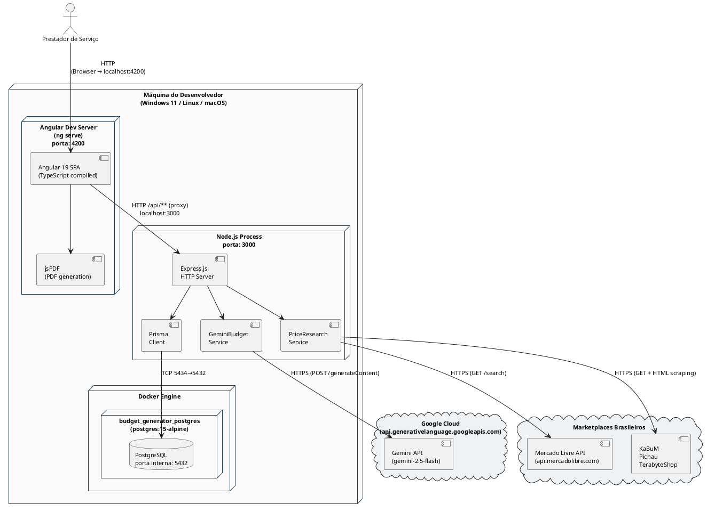
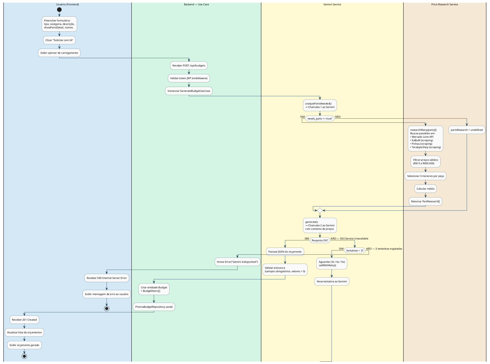
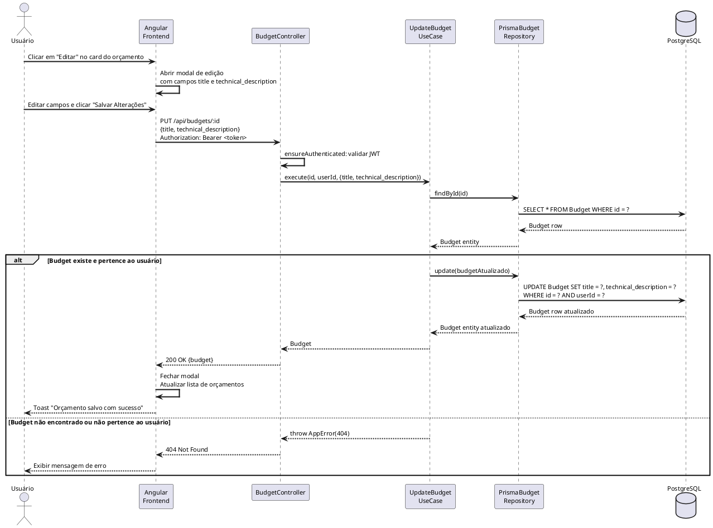

# Diagramas PlantUML — BudgetGenerator TCC
# Como usar: copie o bloco de código de cada seção em https://www.plantuml.com/plantuml/uml/
# ou em qualquer plugin PlantUML de VS Code / IntelliJ

---

======================== DIAGRAMA ER (Banco de Dados) ========================

---

======================== DIAGRAMA DE CLASSES — CAMADA DE DOMÍNIO ========================

---

======================== DIAGRAMA DE CASO DE USO ========================

---

======================== DIAGRAMA DE SEQUÊNCIA — AUTENTICAÇÃO ========================

---

======================== DIAGRAMA DE SEQUÊNCIA — GERAÇÃO DE ORÇAMENTO ========================

---

======================== DIAGRAMA DE COMPONENTES — CLEAN ARCHITECTURE ========================

```plantuml
@startuml Componentes_Clean_Architecture
skinparam componentStyle rectangle
skinparam componentBackgroundColor #FAFAFA
skinparam packageBackgroundColor #EEF2F5
skinparam packageBorderColor #1B3C53
skinparam defaultFontSize 11

package "Presentation Layer\n(controllers, middlewares)" #D4E8F5 {
  [BudgetController]
  [AuthController]
  [UserController]
  [ensureAuthenticated] <<middleware>>
  [errorMiddleware] <<middleware>>
}

package "Application Layer\n(use cases, DTOs)" #D4F5E4 {
  [GenerateBudgetUseCase]
  [ListUserBudgetsUseCase]
  [GetBudgetByIdUseCase]
  [DeleteBudgetUseCase]
  [UpdateBudgetUseCase]
  [GetBudgetStatsUseCase]
  [AuthenticateUserUseCase]
  [RegisterUserUseCase]
  [GetUserProfileUseCase]
  [UpdateUserProfileUseCase]
  [UpdateUserPasswordUseCase]
}

package "Domain Layer\n(entities, interfaces)" #FFF9D4 {
  [Budget Entity]
  [BudgetItem Entity]
  [User Entity]
  [IBudgetRepository] <<interface>>
  [IUserRepository] <<interface>>
  [IBudgetGenerator] <<interface>>
  [IPasswordHasher] <<interface>>
}

package "Infrastructure Layer\n(concrete implementations)" #F5D4D4 {
  [PrismaBudgetRepository]
  [PrismaUserRepository]
  [GeminiBudgetService]
  [PriceResearchService]
  [BcryptPasswordHasher]
  [prismaClient] <<singleton>>
}

cloud "External Services" {
  [Google Gemini API] <<external>>
  [Mercado Livre API] <<external>>
  [KaBuM / Pichau / Terabyte] <<external>>
}

database "PostgreSQL\n(Docker)" as PG

' Presentation → Application
[BudgetController] --> [GenerateBudgetUseCase]
[BudgetController] --> [ListUserBudgetsUseCase]
[BudgetController] --> [GetBudgetByIdUseCase]
[BudgetController] --> [DeleteBudgetUseCase]
[BudgetController] --> [UpdateBudgetUseCase]
[BudgetController] --> [GetBudgetStatsUseCase]
[AuthController] --> [AuthenticateUserUseCase]
[UserController] --> [GetUserProfileUseCase]
[UserController] --> [UpdateUserProfileUseCase]
[UserController] --> [UpdateUserPasswordUseCase]

' Application → Domain (interfaces)
[GenerateBudgetUseCase] --> [IBudgetRepository]
[GenerateBudgetUseCase] --> [IBudgetGenerator]
[GenerateBudgetUseCase] --> [PriceResearchService]
[ListUserBudgetsUseCase] --> [IBudgetRepository]
[AuthenticateUserUseCase] --> [IUserRepository]
[AuthenticateUserUseCase] --> [IPasswordHasher]
[RegisterUserUseCase] --> [IUserRepository]
[RegisterUserUseCase] --> [IPasswordHasher]

' Infrastructure implements Domain interfaces
[IBudgetRepository] <|.. [PrismaBudgetRepository]
[IUserRepository] <|.. [PrismaUserRepository]
[IBudgetGenerator] <|.. [GeminiBudgetService]
[IPasswordHasher] <|.. [BcryptPasswordHasher]

' Infrastructure → External
[PrismaBudgetRepository] --> [prismaClient]
[PrismaUserRepository] --> [prismaClient]
[prismaClient] --> PG
[GeminiBudgetService] --> [Google Gemini API]
[PriceResearchService] --> [Mercado Livre API]
[PriceResearchService] --> [KaBuM / Pichau / Terabyte]
@enduml
```

---

======================== DIAGRAMA DE IMPLANTAÇÃO (DEPLOYMENT) ========================

---

======================== DIAGRAMA DE ATIVIDADES — GERAÇÃO DE ORÇAMENTO ========================

---

======================== DIAGRAMA DE CLASSES — CAMADA DE APLICAÇÃO (USE CASES) ========================

```plantuml
@startuml Classes_Application
skinparam classBackgroundColor #FAFAFA
skinparam classBorderColor #1B3C53
skinparam defaultFontSize 10
skinparam packageBackgroundColor #EEF2F5

package "Application — Use Cases" {

  class GenerateBudgetUseCase {
    -budgetRepository: IBudgetRepository
    -budgetGenerator: IBudgetGenerator
    -priceResearchService: PriceResearchService
    +execute(data: GenerateBudgetDTO): Promise<Budget>
  }

  class ListUserBudgetsUseCase {
    -budgetRepository: IBudgetRepository
    +execute(userId: string): Promise<Budget[]>
  }

  class GetBudgetByIdUseCase {
    -budgetRepository: IBudgetRepository
    +execute(id: string, userId: string): Promise<Budget>
  }

  class UpdateBudgetUseCase {
    -budgetRepository: IBudgetRepository
    +execute(id: string, userId: string, data: UpdateBudgetDTO): Promise<Budget>
  }

  class DeleteBudgetUseCase {
    -budgetRepository: IBudgetRepository
    +execute(id: string, userId: string): Promise<void>
  }

  class GetBudgetStatsUseCase {
    -budgetRepository: IBudgetRepository
    +execute(userId: string): Promise<BudgetStats>
  }

  class AuthenticateUserUseCase {
    -userRepository: IUserRepository
    -passwordHasher: IPasswordHasher
    +execute(data: AuthDTO): Promise<AuthResult>
  }

  class RegisterUserUseCase {
    -userRepository: IUserRepository
    -passwordHasher: IPasswordHasher
    +execute(data: RegisterDTO): Promise<User>
  }

  class UpdateUserProfileUseCase {
    -userRepository: IUserRepository
    +execute(userId: string, data: UpdateProfileDTO): Promise<User>
  }

  class UpdateUserPasswordUseCase {
    -userRepository: IUserRepository
    -passwordHasher: IPasswordHasher
    +execute(userId: string, data: UpdatePasswordDTO): Promise<void>
  }
}

package "DTOs" {
  class GenerateBudgetDTO {
    +userId: string
    +tipo: BudgetTipo
    +categoria: BudgetCategoria
    +descricao_cliente: string
    +showPartsDetail: boolean
    +cliente_nome?: string
    +prestador_nome?: string
  }

  class UpdateBudgetDTO {
    +title?: string
    +technical_description?: string
  }

  class AuthDTO {
    +email: string
    +senha: string
  }

  class AuthResult {
    +token: string
    +user: User
  }
}

GenerateBudgetUseCase ..> GenerateBudgetDTO : uses
UpdateBudgetUseCase ..> UpdateBudgetDTO : uses
AuthenticateUserUseCase ..> AuthDTO : uses
AuthenticateUserUseCase ..> AuthResult : returns
@enduml
```

---

======================== DIAGRAMA DE SEQUÊNCIA — EDIÇÃO DE ORÇAMENTO ========================

